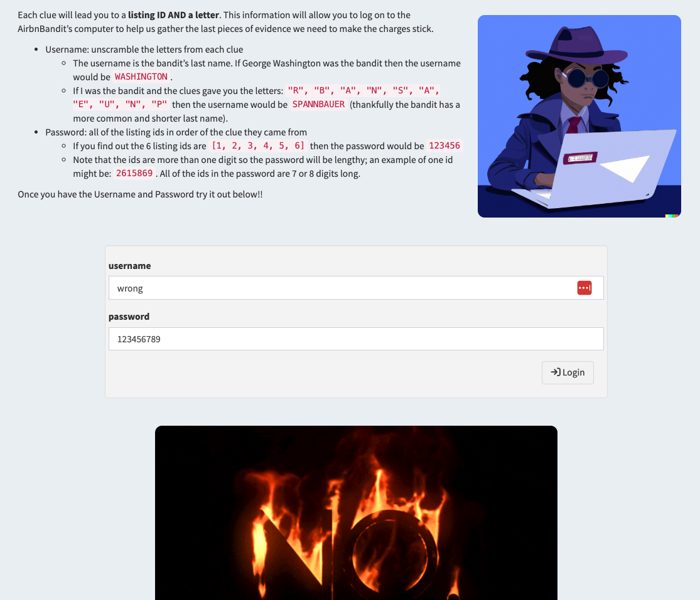
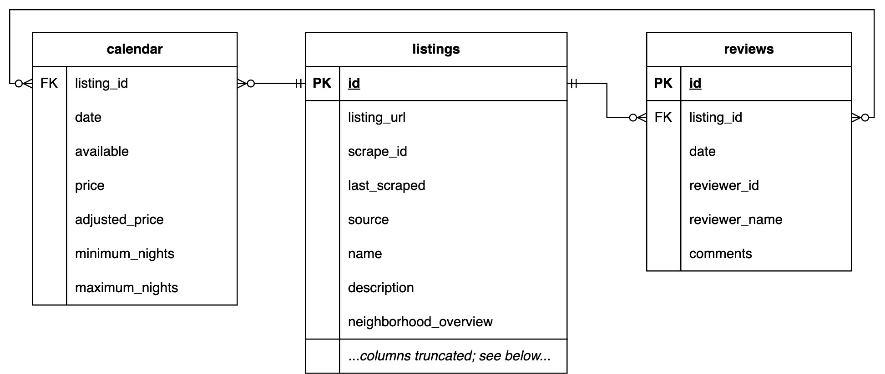

  

# AirbnBandit SQL hunt

<pre>

WANTED: AirbnBandit

For crimes against the city of Asheville.

The suspect should be assumed to be dangerous and
armed with the knowledge of Bayesian statistics.
</pre>

## The background

A crime was committed in Asheville, NC.  The cyber criminal was a major user of Airbnb to avoid staying in one spot or using the same IP address for too long.

Your job is to scour for clues in a database holding all of the Airbnb listings in Asheville.  Some of our other detectives' intel will help guide your investigation.

## The task

Each clue will lead you to a **listing ID AND a letter**.  This information will allow you to log on to the AirbnBandit's computer to help us gather the last pieces of evidence we need to make the charges stick.

* Username: unscramble the letters from each clue
  * The username is the bandit's last name. If George Washington was the bandit then the username would be `WASHINGTON`.
  * If I was the bandit and the clues gave you the letters: `"R", "B", "A", "N", "S", "A", "E", "U", "N", "P"` then the username would be `SPANNBAUER` (thankfully the bandit has a more common and shorter last name).
* Password: all of the listing ids in order of the clue they came from
  * If you find out the 6 listing ids are `[1, 2, 3, 4, 5, 6]` then the password would be `123456`
  * Note that the ids are more than one digit so the password will be lengthy; an example of one id might be: `2615869`.  All of the ids in the password are 7 or 8 digits long.

Once you have the Username and Password try it out on the login page!!

## The answer key

No peeking until you've tried! - [`answer_key_queries.sql`](answer_key_queries.sql)

## The app

### Example clue page

Read the clue carefully, craft your query, and check a piece of your answer.

 

### Example login attempt

Once you've discovered the username and password test them on the login page.  You'll get a response via gif if you've been successful.

 

  

## SQL resources

First things first, this is not a SQL tutorial! Here are links to various SQL notes, activities, etc.

* Free stuff!
  * [A SQL cheatsheet from learnsql.com](https://learnsql.com/blog/sql-basics-cheat-sheet/sql-basics-cheat-sheet-a4.pdf)
  * [Adam S. notes from another SQL workshop](https://drive.google.com/file/d/1JxDmLWsSaiGeqZd8sgz_FcfeWjNIeFbg/view)
  * [Quick bite-sized learning from w3schools.com](https://www.w3schools.com/sql/)
  * [Longer form tutorial from sqlbolt.com](https://sqlbolt.com/)
  * [Longer form tutorial from selectstarsql.com](https://selectstarsql.com/)
  * [SQL murder mystery!! (from knightlab.com)](https://mystery.knightlab.com/)
    * This wonderful resource is the inspo for this activity
  * Practice prompts: [codewars.com](codewars.com), [leetcode.com](leetcode.com), [hackerrank.com](hackerrank.com), & more
* Not free..
  * [DataQuest SQL courses](https://www.dataquest.io/path/sql-skills/)
  * [DataCamp SQL courses](datacamp.com/learn/sql)
    * If you're a student in UTK's BAS dept, we often have subscriptions available at the start of each semester

## About the data

### Data source

Available tables hold information about Airbnb listings in Asheville, North Carolina.

Downloaded from http://insideairbnb.com/get-the-data/ (files downloaded: `calendar.csv.gz`, `reviews.csv.gz`, & `listings.csv.gz`)

Data extract created 2023-03-19.

### Table relationships

  

### Table names and columns

#### `calendar`

* listing_id
* cal_date
* available
* price
* adjusted_price
* minimum_nights
* maximum_nights

#### `reviews`

* listing_id
* id
* review_date
* reviewer_id
* reviewer_name
* comments

#### `listings` - most clues use only this table

* id
* listing_url
* scrape_id
* last_scraped
* source
* name
* description
* neighborhood_overview
* picture_url
* host_id
* host_url
* host_name
* host_since
* host_location
* host_about
* host_response_time
* host_response_rate
* host_acceptance_rate
* host_is_superhost
* host_thumbnail_url
* host_picture_url
* host_neighbourhood
* host_listings_count
* host_total_listings_count
* host_verifications
* host_has_profile_pic
* host_identity_verified
* neighbourhood
* neighbourhood_cleansed
* neighbourhood_group_cleansed
* latitude
* longitude
* property_type
* room_type
* accommodates
* bathrooms
* bathrooms_text
* bedrooms
* beds
* amenities
* price
* minimum_nights
* maximum_nights
* minimum_minimum_nights
* maximum_minimum_nights
* minimum_maximum_nights
* maximum_maximum_nights
* minimum_nights_avg_ntm
* maximum_nights_avg_ntm
* calendar_updated
* has_availability
* availability_30
* availability_60
* availability_90
* availability_365
* calendar_last_scraped
* number_of_reviews
* number_of_reviews_ltm
* number_of_reviews_l30d
* first_review
* last_review
* review_scores_rating
* review_scores_accuracy
* review_scores_cleanliness
* review_scores_checkin
* review_scores_communication
* review_scores_location
* review_scores_value
* license
* instant_bookable
* calculated_host_listings_count
* calculated_host_listings_count_entire_homes
* calculated_host_listings_count_private_rooms
* calculated_host_listings_count_shared_rooms
* reviews_per_month